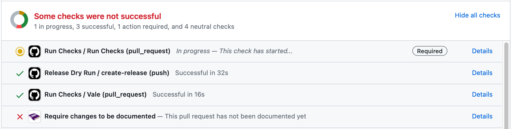

Knope has a GitHub App that enforces that changes are documented before allowing a pull request to be merged.

.

:::caution

This bot is new and doesn't yet support all the types of changes that Knope does.
Please [open an issue](https://knope-dev/knope/issues/new) if you find a bug or have a feature request.
See [the reference docs](/reference/knope-bot-github-app/features) for more details.

:::

You can install the bot from [its public page](https://github.com/apps/knope-bot).
Only install it for the repositories you want to enforce documentation on (as it will do this by default).
