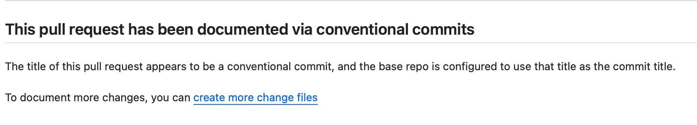

Knope Bot is a GitHub App that performs common Knope tasks automatically without complex GitHub Actions workflows.
You can install the bot from [its public page](https://github.com/apps/knope-bot).
Only install it for the repositories you want to enforce documentation on (as it will do this by default).

## Enforcing documentation

The bot keeps an up-to-date check on all pull requests to ensure that they are documented,
either with at least one [change file] or with _only_
[conventional][conventional commit] commits.

### Double-checking documentation

When a check from Knope Bot passes, the details will include an explanation of _why_ the check passed.
This allows you to double-check Knope's work.

:::note

For efficiency, Knope Bot stops processing as soon as a check passes. So, if a pull request is documented in more than
one way, only the first will appear in the check details.

:::

### Squash commits

If a repository is configured to use _only_ squash commits,
and is set to _always_ use the pull request title as the commit title, then a pull request title which looks like
a [conventional commit] will pass the check:

### Change files

If a pull request contains at least one [change file][change file], it will pass the check:

### Other conventional commits

:::caution

Knope Bot doesn’t yet support repositories which allow merge commits or rebasing,
nor does it allow squash strategies that don't use the pull request title as the commit title.

:::

## Quickly creating change files

When a check fails, the details of that check will contain instructions for creating a changeset:

For pull requests that are not from forks,
project members will see buttons to create [change files][change file] directly for the three main [change types](/reference/concepts/semantic-versioning).
Clicking one of those buttons will cause the bot to commit the change file directly to the pull request branch.

For anyone who can't see those buttons (or anyone who wants more control over the change documentation), there is a
link to using Knope's CLI and example Markdown that can be copied into a change file manually.

[change file]: /reference/concepts/change-file
[conventional commit]: /reference/concepts/conventional-commits
