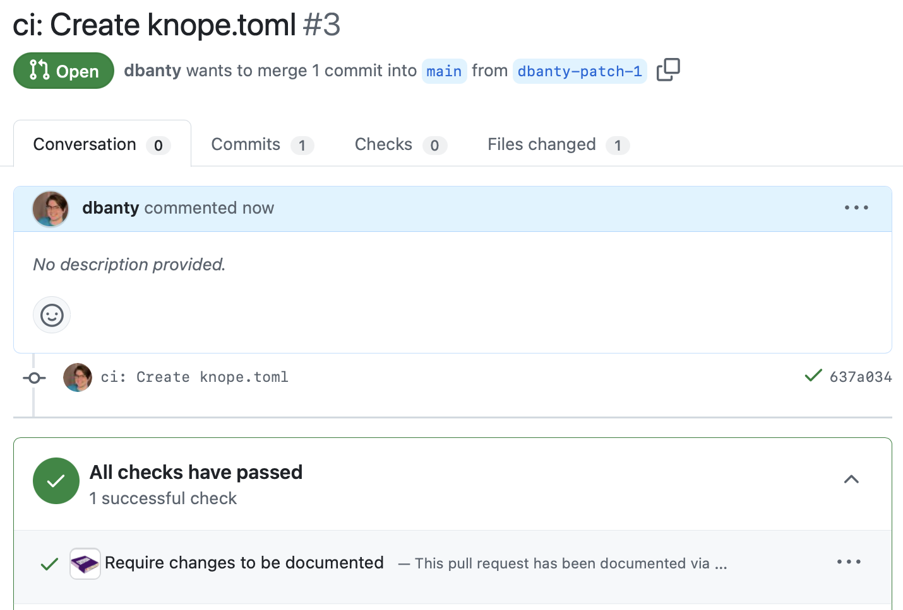

import { Steps } from "@astrojs/starlight/components";

Most projects can start using Knope immediately by just installing the GitHub bot!
This tutorial will take you step by step through the process of:

1. Documenting changes in pull requests
2. Previewing releases
3. Creating releases on GitHub
4. Triggering GitHub Actions from the release

The only prerequisite is a GitHub account.

:::tip

Not using GitHub, or don't want a bot? Check out [the CLI tutorial](/tutorials/releasing-basic-projects).

:::

## Part 1: Setup

<Steps>

1. Create a new repository on GitHub using their UI.
   You can name this repository whatever you like, but this tutorial will refer to it as "knope-tutorial" from now on.
   You can set it to private. **Check "Add a README file"** as this will make later steps easier.

2. Install Knope Bot [from the GitHub Marketplace](https://github.com/marketplace/knope-bot).
   You probably want to only install this bot (and any bot) for the repos you intend to use it on, so select "Only select repositories"
   when prompted and choose "knope-tutorial".

</Steps>

## Part 2: Enforcing change documentation

By default, Knope enforces that all pull requests to all installed repositories are documented with at least one [change file] or all [conventional commits].
Create a new pull request to see this in action:

<Steps>

1. Back in the "knope-tutorial" repository on GitHub, create a new file by pressing "Add a file", then "Create new file".
   If you're on a smaller screen or did not create a README with your repo, your options will look different.
   

2. Name the file `package.json` and set the contents to `{"version": "1.0.0"}`. Then click "Commit changes..."
   

3. Leave the commit message as the default, and choose "Create a new branch for this commit and start a pull request".
   Then click "Propose changes".
   

4. Leave everything as default and click "Create pull request"
   

5. You should see a failing check appear on the pull request shortly.
   Get more info about the check by clicking the title of the check: "Require changes to be documented".
   

6. The details of the check will explain why it failed and give you some options for documenting the change.

</Steps>

:::tip

If the failing check didn't appear, Knope Bot wasn't installed correctly!
Go to the [app page](https://github.com/apps/knope-bot) and press "Configure",
then make sure the correct repo was selected.

:::

## Part 3: Documenting changes

It's important to explain to your users what to expect from each release,
and there's no better time to do that than when you're making the pull request and remember all the details!

<Steps>

1. You can document changes using either [change files][change file] or [conventional commits].
   Commit messages usually describe how the code changed, not how the change affects users, so for most pull requests you should
   add a change file.
   The details of the failing check include three buttons for adding change files depending on the type of change that you made.
   Click "Minor (Feature)"
   

2. When you click that button, Knope Bot will create a change file for you and push it to your branch.
   Go to the "Files changed" tab in the pull request to see the new file.
   

3. A change file is a specially formatted Markdown file that describes the change in a machine-readable way.
   Knope Bot includes the title and body of the pull request, as well as the pull request number and author's username.
   You can edit the content of this file to add more details.
   Now head back to the main "Conversation" tab of the pull request and look at the checks.
   The "Require changes to be documented" check should now pass.
   

4. Merge this pull request. You've now documented your first change!

</Steps>

## Part 4: Previewing releases

When releases are enabled, Knope Bot will keep an up-to-date pull request with a preview of your next release.
You'll be able to see the release notes as well as the next version of your project.

<Steps>

1. Releases are not enabled by default. To enable them, create a new file called "knope.toml" in the root of your repository.
   First, tell Knope which files to update version numbers in with `package.versioned_files = ["package.json"]`.
   Then, enable releases with `bot.releases.enabled = true`. **Don't commit yet**.
   

2. Some changes don't affect users directly, but Knope Bot is going to enforce that changes are documented in every pull request.
   Conventional commits can indicate that a change is _not_ intended to be user-facing.
   Use the commit message `ci: Add knope.toml` to commit the new file and open a pull request.
   

3. The `ci:` prefix in the commit message makes it a conventional commit, which
   Knope Bot accepts as valid change documentation.
   [Some prefixes][conventional commits] will affect the release,
   others like `ci` are ignored.
   

4. Merge that pull request to enable releases, then go to the pull requests tab in your repository.
   Within a couple minutes, you should see a new pull request titled "Release 1.1.0" opened by `knope-bot`.
   Open that PR to see what the release will look like.
   

5. Knope Bot's release pull requests include the release notes in the body of the pull request.
   In this case, only the first pull request with the change "Create package.json" is included.
   Because you selected "Feature" when creating the change file, this is considered a minor change, and listed under a "Features" heading.
   Now head to the "Files changed" tab of the release PR.
   

6. Knope Bot updates the version number in `package.json`, just like we told it to, and deletes the change file.

</Steps>

## Part 5: Keeping a changelog (optional)

It's common to want to keep release notes in a Markdown file in addition to GitHub releases.

<Steps>

1. Edit the `knope.toml` file and add the line `package.changelog = "CHANGELOG.md"`.
   Commit that change to the default branch with the conventional commit message `feat: Add CHANGELOG.md`.
   

2. Head back to the release pull request, Knope Bot should have automatically updated it for you.
   There should now be a bullet point in the "Features" section with the note "Add CHANGELOG.md".
   One-line changes like conventional commits are documented as bullet points
   instead of sections with headers.
   

3. Check out the "Files changed" tab. Knope Bot created a `CHANGELOG.md` file with the release notes.
   The `package.changelog` config tells Knope Bot to keep a Markdown file up to date with every release.
   

</Steps>

## Part 6: Creating the release

As the description of the release pull request says, when you merge it, a release will be created on GitHub.

<Steps>

1. Merge the release pull request and go back to the main "Code" page
   of your repository. You should see a new release under the "Releases" section.
   
2. Click on the release name to open it.
   The release title contains the date of the release and the version number.
   A new Git tag called `v1.1.0` was also created.
   
3. That's it, release created!

</Steps>

## Part 7: Running GitHub Actions

Usually, releasing a project involves more than just creating the release on GitHub. You may need to publish the code to a package manager or build some binaries. You can do that using a GitHub Action:

```yaml
name: Release

on:
  pull_request:
    types: [closed]
    branches: [main]
  workflow_dispatch:

jobs:
  release:
    if: (github.head_ref == 'knope/release' && github.event.pull_request.merged == true) || github.event_name == 'workflow_dispatch'
    runs-on: ubuntu-latest
    steps:
      # Your release steps here
```

You _could_ use the `on.release` event type, but that event is much more picky.
For example, if the release was created as a draft, you can't easily detect it
with a release event. Knope Bot always uses a branch called `knope/release` for
release pull requests, so you can use that to detect releases.

[change file]: /reference/concepts/change-file
[conventional commits]: /reference/concepts/conventional-commits
