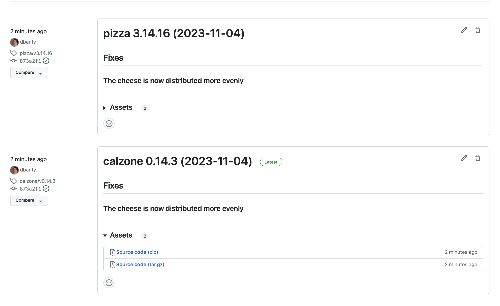

Sometimes you have more than one package in a repository, commonly called a monorepo.
This tutorial will show you how to:

1. Create a Knope config file for multiple packages
2. Document changes that only impact _some_ packages
3. Document changes that impact _all_ packages

:::tip
A package is a collection of files with _one version_ that is released all at once.
You can have multiple versioned files in a single package, for example,
a `Cargo.toml` and a `pyproject.toml` for a package that is released to both crates.io and PyPI.
For this pattern, check out the [multiple versioned files recipe](/recipes/multiple-versioned-files).
:::

## Prerequisites

- [Git](https://git-scm.com/): The `git` CLI must be available in your terminal.
  It is helpful if you know the basics of commits and tags.
- A text editor: We'll be editing Markdown and TOML files. [Visual Studio Code](https://code.visualstudio.com/) is a good free choice.
- Familiarity with a command line terminal, like "Terminal" on macOS or "PowerShell" Windows
- A [GitHub](https://github.com) account (you can use an alternative, but the results will be different)
- [Install Knope](/installation)

## Create a new Git repo

Let's start by creating a new directory, moving into it, and initializing a Git repository.

```shell
mkdir knope-tutorial
cd knope-tutorial
git init
```

We're also going to eventually need this repo on GitHub so we can see our releases,
I'll do that with the [GitHub CLI](https://cli.github.com/):

```shell
gh repo create --private knope-tutorial --source .
```

## Create a Knope config file

To have multiple packages, we need to create a [config file](/reference/Config File/packages):

```shell
knope --generate
```

The default `knope.toml` file which was created is for a single package, but we want multiple packages.
Open it up in your editor and remove the `[package]` section, then add three `[packages]` sections:

```toml title="knope.toml" del={1} ins={2-6}
[package]
[packages.pizza]

[packages.toppings]

[packages.calzone]
```

## Set up the monorepo

Each of our packages should have some versioned files, as well as a changelog.
My favorite language is Rust, so I'm going to use `Cargo.toml` files,
but Knope supports [many file formats](/reference/config-file/packages#versioned_files).

```toml title="knope.toml" ins={2-3,6-7,10-11}
[packages.pizza]
versioned_files = ["pizza/Cargo.toml"]
changelog = "pizza/CHANGELOG.md"

[packages.toppings]
versioned_files = ["toppings/Cargo.toml"]
changelog = "toppings/CHANGELOG.md"

[packages.calzone]
versioned_files = ["calzone/Cargo.toml"]
changelog = "calzone/CHANGELOG.md"
```

We need to actually create those files as well:

```toml title="pizza/Cargo.toml"
[package]
version = "3.14.15"
```

```md title="pizza/CHANGELOG.md"
# Pizza Changelog

Documenting everything new in the world of Pizza.

```

```toml title="toppings/Cargo.toml"
[package]
version = "1.209.0"
```

```md title="toppings/CHANGELOG.md"
# Toppings Changelog

New toppings are added here

```

```toml title="calzone/Cargo.toml"
[package]
version = "0.14.2"
```

```md title="calzone/CHANGELOG.md"
# Calzone Changelog
```

Let's commit this to give us a good starting point:

```shell
git add .
git commit -m "Initial setup"
```

## Some monorepo limitations

Let's see if we've done everything correctly, Knope will tell us if there are any problems with the config file:

```shell
knope --validate
```

You should see an error like this:

```text
Error:   × There are problems with the defined workflows

Error:   × Problem with workflow release

Error: variables::too_many_packages

  × Too many packages defined
  help: The Version variable in a Command step can only be used with a single [package].
```

It looks like we have a bit more work to do to convert this to a monorepo.
Multi-package setups have some extra limitations at the time of writing, like you can't use the `Version` variable.
Let's remove it:

```toml title="knope.toml" del={4-6} del=" $version"
[[workflows.steps]]
type = "Command"
command = "git commit -m \"chore: prepare release $version\" && git push"

[workflows.steps.variables]
"$version" = "Version"
```

```shell
knope --validate
```

If everything is correct, you'll see no output.

<details>
<summary>Full `knope.toml` at this stage</summary>
```toml title="knope.toml"
[packages.pizza]
versioned_files = ["pizza/Cargo.toml"]
changelog = "pizza/CHANGELOG.md"

[packages.toppings]
versioned_files = ["toppings/Cargo.toml"]
changelog = "toppings/CHANGELOG.md"

[packages.calzone]
versioned_files = ["calzone/Cargo.toml"]
changelog = "calzone/CHANGELOG.md"

[[workflows]]
name = "release"

[[workflows.steps]]
type = "PrepareRelease"

[[workflows.steps]]
type = "Command"
command = "git commit -m \"chore: prepare release\" && git push"

[[workflows.steps]]
type = "Release"

[[workflows]]
name = "document-change"

[[workflows.steps]]
type = "CreateChangeFile"
```
</details>

## Documenting changes

As with a single package,
we can document changes
using either [changesets](/glossary/changeset) or [conventional commits](/glossary/conventional-commits).
Let's start with changesets.

### Changesets

```shell
knope document-change
```

:::tip
That `document-change` command comes from the workflow in `knope.toml` with the same name, go check it out!
:::

You'll be prompted to select which packages the change impacts:

```text
? Which packages does this change affect?
> [ ] pizza
  [ ] toppings
  [ ] calzone
[↑↓ to move, space to select one, → to all, ← to none, type to filter]
```

Let's use the arrow keys and space bar to select `pizza` and `calzone`, then press enter.
Next, select `patch` as the change type for each (they're in order):

```text
> Which packages does this change affect? pizza, calzone
> What type of change is this? patch
? What type of change is this?
  major
  minor
> patch
[↑↓ to move, enter to select, type to filter]
```

Finally, we summarize the change:

```text
> Which packages does this change affect? pizza, calzone
> What type of change is this? patch
> What type of change is this? patch
? What is a short summary of this change? The cheese is now distributed more evenly
[This will be used as a header in the changelog]
```

This will create a change file that looks like this:

```md title=".changeset/the_cheese_is_now_distributed_more_evenly.md"
---
calzone: patch
pizza: patch
---

# The cheese is now distributed more evenly

```

It includes the name of each package that the change impacts,
the type of change for each of those packages, and the summary we input.
At this point,
we could add as much Markdown as we want to the bottom of the file to describe the change more fully.

Let's take a look at what sort of releases this will create:

```shell
knope release --dry-run
```

```text
Would delete: .changeset/the_cheese_is_now_distributed_more_evenly.md
Would delete: .changeset/the_cheese_is_now_distributed_more_evenly.md
Would add the following to pizza/Cargo.toml: 3.14.16
Would add the following to pizza/CHANGELOG.md:
## 3.14.16 (2023-11-04)

### Fixes

#### The cheese is now distributed more evenly

Would add files to git:
  pizza/Cargo.toml
  pizza/CHANGELOG.md
  .changeset/the_cheese_is_now_distributed_more_evenly.md
Would add the following to calzone/Cargo.toml: 0.14.3
Would add the following to calzone/CHANGELOG.md:
## 0.14.3 (2023-11-04)

### Fixes

#### The cheese is now distributed more evenly

Would add files to git:
  calzone/Cargo.toml
  calzone/CHANGELOG.md
  .changeset/the_cheese_is_now_distributed_more_evenly.md
Would run git commit -m "chore: prepare release" && git push
Would create Git tag pizza/v3.14.16
Would create Git tag calzone/v0.14.3
```

The packages are versioned independently, and their changelogs are updated independently.
Because we didn't add any changes to `toppings`, nothing will happen to it.

:::caution
Note the Git tag format, it's `<package name>/v<version>`. This differs from the single-package format of `v<version>`.
:::

### Conventional commits

While changesets are _designed_ for monorepos, conventional commits require a bit more care.
Let's try to recreate the same change we did with changesets, but with conventional commits.

```shell
rm .changeset/the_cheese_is_now_distributed_more_evenly.md
git commit --allow-empty -m "fix: The cheese is now distributed more evenly"
```

```shell
knope release --dry-run
```

```text
Would add the following to pizza/Cargo.toml: 3.14.16
Would add the following to pizza/CHANGELOG.md:
## 3.14.16 (2023-11-04)

### Fixes

#### The cheese is now distributed more evenly

Would add files to git:
  pizza/Cargo.toml
  pizza/CHANGELOG.md
Would add the following to toppings/Cargo.toml: 1.209.1
Would add the following to toppings/CHANGELOG.md:
## 1.209.1 (2023-11-04)

### Fixes

#### The cheese is now distributed more evenly

Would add files to git:
  toppings/Cargo.toml
  toppings/CHANGELOG.md
Would add the following to calzone/Cargo.toml: 0.14.3
Would add the following to calzone/CHANGELOG.md:
## 0.14.3 (2023-11-04)

### Fixes

#### The cheese is now distributed more evenly

Would add files to git:
  calzone/Cargo.toml
  calzone/CHANGELOG.md
Would run git commit -m "chore: prepare release" && git push
Would create Git tag pizza/v3.14.16
Would create Git tag toppings/v1.209.1
Would create Git tag calzone/v0.14.3
```

By default, conventional commits are applied to _all_ packages.
If we want to limit commits to specific packages, we can configure scopes in `knope.toml`:

```toml title="knope.toml" ins={4,13}
[packages.pizza]
versioned_files = ["pizza/Cargo.toml"]
changelog = "pizza/CHANGELOG.md"
scopes = ["pizza"]

[packages.toppings]
versioned_files = ["toppings/Cargo.toml"]
changelog = "toppings/CHANGELOG.md"

[packages.calzone]
versioned_files = ["calzone/Cargo.toml"]
changelog = "calzone/CHANGELOG.md"
scopes = ["calzone"]
```

Now, conventional commits which have the `pizza` scope will only be applied to the `pizza` package,
and `calzone` commits will only be applied to the `calzone` package.
Commits _without_ scopes (like the one we just committed) will still be applied to all packages,
you can verify that with `knope release --dry-run` again.

Let's undo that commit:

```shell
git reset HEAD~
```

We _could_ now recreate the change we did with changesets with _two_ commits:

:::caution
Don't do this, it's just for demonstration, there's a better way!
```shell
git commit --allow-empty -m "fix(pizza): The cheese is now distributed more evenly"
git commit --allow-empty -m "fix(calzone): The cheese is now distributed more evenly"
```
:::

But the _point_ of conventional commits is that we're documenting the changes made _within_ the commit,
so it probably doesn't make sense to have two commits for the same change.
Instead, we could create a new scope that impacts _both_ packages:

```toml title="knope.toml" ins={4,13}
[packages.pizza]
versioned_files = ["pizza/Cargo.toml"]
changelog = "pizza/CHANGELOG.md"
scopes = ["pizza", "pizza-and-calzone"]

[packages.toppings]
versioned_files = ["toppings/Cargo.toml"]
changelog = "toppings/CHANGELOG.md"

[packages.calzone]
versioned_files = ["calzone/Cargo.toml"]
changelog = "calzone/CHANGELOG.md"
scopes = ["calzone", "pizza-and-calzone"]
```

Now, we can create a single commit that impacts both `pizza` and `calzone`, but not `toppings`:

```shell
git commit --allow-empty -m "fix(pizza-and-calzone): The cheese is now distributed more evenly"
```

```shell
knope release --dry-run
```

```text
Would add the following to pizza/Cargo.toml: 3.14.16
Would add the following to pizza/CHANGELOG.md:
## 3.14.16 (2023-11-04)

### Fixes

#### The cheese is now distributed more evenly

Would add files to git:
  pizza/Cargo.toml
  pizza/CHANGELOG.md
Would add the following to calzone/Cargo.toml: 0.14.3
Would add the following to calzone/CHANGELOG.md:
## 0.14.3 (2023-11-04)

### Fixes

#### The cheese is now distributed more evenly

Would add files to git:
  calzone/Cargo.toml
  calzone/CHANGELOG.md
Would run git commit -m "chore: prepare release" && git push
Would create Git tag pizza/v3.14.16
Would create Git tag calzone/v0.14.3
```

We get back exactly the same result as we did with changesets, but with a single commit.

:::tip
Use conventional commits sparingly, for simple changes only.
Usually, a change that impacts multiple packages is worth documenting more thoroughly with a changeset.
:::

## Adding GitHub releases

We can see from the `--dry-run` that Knope will create Git tags for us,
but we can go even further by integrating with GitHub.
All we have to do is tell Knope about our GitHub repo:

```toml title="knope.toml" ins={1-2}
[github]
repo = "knope-tutorial"  # If you created the repo with a different name, use it here
owner = "dbanty"  # Replace this with your GitHub username
```

Now, without changing the `release` workflow at all, we can see that Knope will create GitHub releases:

```text
Would add the following to pizza/Cargo.toml: 3.14.16
Would add the following to pizza/CHANGELOG.md:
## 3.14.16 (2023-11-04)

### Fixes

#### The cheese is now distributed more evenly

Would add files to git:
  pizza/Cargo.toml
  pizza/CHANGELOG.md
Would add the following to calzone/Cargo.toml: 0.14.3
Would add the following to calzone/CHANGELOG.md:
## 0.14.3 (2023-11-04)

### Fixes

#### The cheese is now distributed more evenly

Would add files to git:
  calzone/Cargo.toml
  calzone/CHANGELOG.md
Would run git commit -m "chore: prepare release" && git push
Would create a release on GitHub with name pizza 3.14.16 (2023-11-04) and tag pizza/v3.14.16 and body:
## Fixes

### The cheese is now distributed more evenly
Would create a release on GitHub with name calzone 0.14.3 (2023-11-04) and tag calzone/v0.14.3 and body:
## Fixes

### The cheese is now distributed more evenly
```

:::caution
The next step will save GitHub credentials to a file on your computer.
If you don't want that, you can instead set the `GITHUB_TOKEN` environment variable to the token.
:::

Let's try it out for real:

```shell
knope release
```

If you don't have a GitHub token set, you'll be prompted to create one and paste it into the terminal.
Once you do, you'll see some output from Git.
If there are no errors, your releases should be created!

Open your repo in GitHub (you can use `gh repo view --web`), and click on "Releases" on the side.
You should see something like this:



Knope creates one release on GitHub per package so that it's easy for consumers to see
what's changed in only the packages they care about!

## Wrapping up

In this tutorial, you:

1. Configured Knope for a monorepo
2. Documented changes using both changesets and conventional commits
3. Created GitHub releases for each package

Next up, you should consider [using GitHub Actions to automate releases](/recipes/workflow-dispatch-releases).

:::note
Don't forget to clean up your GitHub repo!
```shell
gh repo delete knope-tutorial
```
