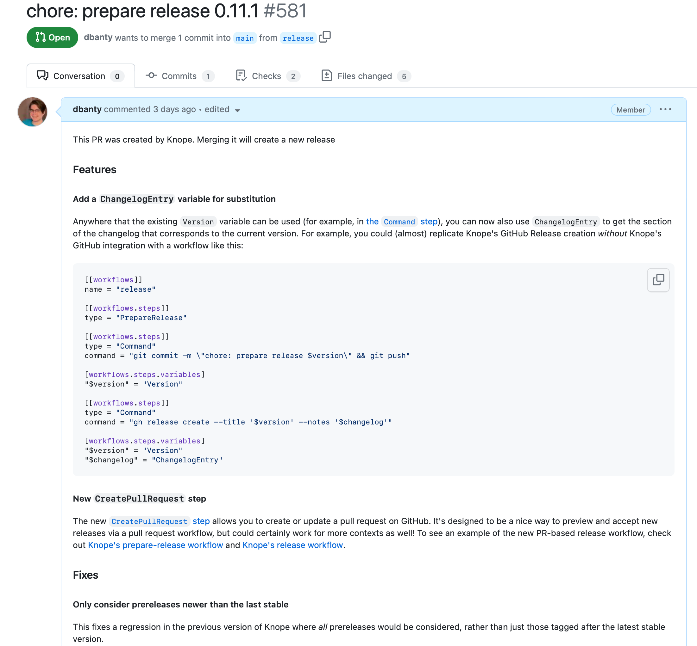

# Pull Request Driven Releases

This recipe keeps an open pull request at all times previewing the changes the Knope will include in the next release. This pull request will let you see the next version, the changes to versioned files, and the changelog. When you merge that pull request, Knope will create a new release with the changes from the pull request.

This is the recipe that Knope uses for its own releases (at the time of writing), so let's walk through the two GitHub Actions workflows and the `knope.toml` that make it work.

## `knope.toml`

We're going to walk through this in pieces for easier explanation, but all of these TOML snippets exist in the same file.

### `[package]`

```toml
[package]
versioned_files = ["Cargo.toml"]
changelog = "CHANGELOG.md"
```

This first piece defines the package, `Cargo.toml` is both the source of the current version of the package and a place we'd like to place new version numbers. You can add more `versioned_files` (for example, if you also released this as a Python package with `pyproject.toml`). `CHANGELOG.md` is where we want to document changes in the source code—this is in _addition_ to GitHub releases.

```admonish warning
You cannot use this recipe right now with multiple packages due to limitations on [variables]. Instead, you can check out the [workflow dispatch workflow].
```

### `[[package.assets]]`

```toml
[[package.assets]]
path = "artifact/knope-x86_64-unknown-linux-musl.tgz"

[[package.assets]]
path = "artifact/knope-x86_64-pc-windows-msvc.tgz"

[[package.assets]]
path = "artifact/knope-x86_64-apple-darwin.tgz"

[[package.assets]]
path = "artifact/knope-aarch64-apple-darwin.tgz"
```

`package.assets` let us define a list of files to upload to GitHub releases. You can also upload them under a different name if you don't want to use the file name by setting `name` in the asset definition.

### `prepare-release` workflow

```toml
[[workflows]]
name = "prepare-release"

[[workflows.steps]]
type = "Command"
command = "git switch -c release"

[[workflows.steps]]
type = "PrepareRelease"

[[workflows.steps]]
type = "Command"
command = "git commit -m \"chore: prepare release $version\" && git push --force --set-upstream origin release"

[workflows.steps.variables]
"$version" = "Version"

[[workflows.steps]]
type = "CreatePullRequest"
base = "main"

[workflows.steps.title]
template = "chore: prepare release $version"
variables = { "$version" = "Version" }

[workflows.steps.body]
template = "This PR was created by Knope. Merging it will create a new release\n\n$changelog"
variables = { "$changelog" = "ChangelogEntry" }
```

The first workflow is called `prepare-release`, so it can be executed by running `knope prepare-release` (as we'll see later in the GitHub Actions workflow). First, it creates a new branch from the current one called `release`, then it runs the [`PrepareRelease`] step which updates our package based on the changes that have been made since the last release. It also stages all of those changes with Git (like `git add`).

Next, we commit the changes that [`PrepareRelease`] made—things like:

- Updating the version in `Cargo.toml`
- Adding a new section to `CHANGELOG.md` with the latest release notes
- Deleting any changesets that have been processed

This commit is pushed to the `release` branch, using the `--force` flag in this case because we don't care about the history of that branch, only the very next release. The [`CreatePullRequest`] step then creates a pull request from the current branch (`release`) to the specified base branch (`main`). We can set the title and body of this pull request using templated strings containing [variables]. In this case, the title contains the new `Version` and the body contains the new `ChangelogEntry`.

The pull request that this creates looks something like this:



All we have to do now is run this `prepare-release` workflow in GitHub Actions whenever we want a new release preview—we'll take a look at that once we finish going through the `knope.toml` file.

### `release` workflow

```toml
[[workflows]]
name = "release"

[[workflows.steps]]
type = "Release"
```

The `release` workflow is a single [`Release`] step—this creates a GitHub release for the latest version (if it hasn't already been released) and uploads any [assets](#packageassets). In this case, it'll create a release for whatever the `prepare-release` workflow made earlier. We'll end up running _this_ workflow whenever the pull request is merged.

### `document-change` workflow

This isn't super relevant to the recipe, but it's useful to have. Changesets are what let us have really descriptive, rich text in changelogs to describe _exactly_ how the latest changes impact our users. Running `knope document-change` executes the [`CreateChangeFile`] workflow to help us make changesets. A future iteration of this recipe may convert pull request comments into changesets 🤞.

```toml
[[workflows]]
name = "document-change"

[[workflows.steps]]
type = "CreateChangeFile"
```

### `[github]`

The last piece is to tell Knope which GitHub repo to use for creating pull requests and releases.

```toml
[github]
owner = "knope-dev"
repo = "knope"
```

## `prepare_release.yml`

There are two GitHub Actions workflows that we're going to use for this recipe—the first one goes in `.github/workflows/prepare_release.yml` and it creates a fresh release preview pull request on every push to the `main` branch:

```yaml
on:
  push:
    branches: [main]
name: Create Release PR
jobs:
  prepare-release:
    if: "!contains(github.event.head_commit.message, 'chore: prepare release')" # Skip merges from releases
    runs-on: ubuntu-latest
    steps:
      - uses: actions/checkout@v4
        with:
          fetch-depth: 0
          token: ${{ secrets.PAT }}
      - name: Configure Git
        run: |
          git config --global user.name GitHub Actions
          git config user.email github-actions@github.com
      - uses: knope-dev/action@v2.0.0
        with:
          version: 0.11.0
      - run: knope prepare-release --verbose
        env:
          GITHUB_TOKEN: ${{ secrets.PAT }}
        continue-on-error: true
```

```admonish note
This workflow runs by default on _every_ push to main, that includes when the previous release PR merges! There is an `if:` clause here in the first job that skips it if the commits matches the commit message that we use in the [`prepare-release` workflow](#prepare-release-workflow). If you change that message, you'll need to update this `if:` clause as well.
```

The steps here:

1. Check out the _entire_ history of the repo (so that [`PrepareRelease`] can use tags and conventional commits to determine the next version). This requires a [personal access token] with permission to **read** the **contents** of the repo.
2. Configure Git so that we can commit changes (within Knope's `prepare-release` workflow)
3. Install Knope
4. Run [the `prepare-release` workflow described above](#prepare-release-workflow). _This_ requires a [personal access token] with permission to **write** the **pull requests** of the repo.

```admonish note
We add the `continue-on-error` attribute so that even if this step fails, the workflow will be marked as passing. This is because we want to be able to run this workflow on every push to `main`, but we don't want it to fail when there's nothing to release. However, this doesn't differentiate between legitimate errors and "nothing to release". You may want to instead use the [`allow_empty` option](../config/step/PrepareRelease.md#options) in `knope.toml` and split the rest of the steps into a second workflow. Then, you can use some scripting in GitHub Actions to skip the rest of the workflow if there's nothing to release.
```

In the case of this action, we're using the same [personal access token] for both steps, but you could use different ones if you wanted to.

## `release.yml`

Now that we're set up to create pull requests previewing the next release on every push to `main`, we need to automatically release those changes when the pull request merges. This is the job of the `release` workflow, which goes in `.github/workflows/release.yml`.

```admonish warning
YAML is very sensitive to white space and very easy to mess up copy/pasting—so I recommend copying the whole file at _the end_, not the individual pieces I'm using to describe functionality.
```

To start off, we only want to run this workflow when our release preview pull requests merge—there are several pieces of config that handle this. First:

```yaml
on:
  pull_request:
    types: [closed]
    branches: [main]
```

Will cause GitHub Actions to only trigger anything at all when a pull request which targets `main` closes. Then, in our _first_ job, we can use this an `if` to narrow that down further to only our release preview pull requests, and only when they _merge_ (not close for other reasons):

```yaml
if: github.head_ref == 'release' && github.event.pull_request.merged == true
```

For Knope's own workflows, this first job is `build-artifacts`, which builds the [package assets](#packageassets) that will be uploaded when releasing. Skipping on past that job (since it probably will be different for you), we come to the `release` job:

```yaml
release:
  needs: [build-artifacts]
  runs-on: ubuntu-latest
  steps:
    - uses: actions/checkout@v4
    - uses: actions/download-artifact@v3
      with:
        name: ${{ env.archive_name }}
    - uses: knope-dev/action@v2.0.0
      with:
        version: 0.11.0
    - run: knope release
      env:
        GITHUB_TOKEN: ${{ secrets.PAT }}

    - run: gh workflow run "Deploy Book to GitHub Pages"
      env:
        GITHUB_TOKEN: ${{ secrets.PAT }}
```

The `release` job follows these steps:

1. Check out the repo at the commit that the pull request merged
2. Download the artifacts that were built in the `build-artifacts` job
3. Install Knope
4. Run [the `release` workflow described above](#release-workflow). This requires a [personal access token] with permission to **write** the **contents** of the repo.
5. Kick off another workflow which updates these docs that you're reading 👋. That requires a [personal access token] with permission to **write** the **actions** of the repo.

Finally, Knope's workflow publishes to crates.io—meaning the whole workflow looks like this:

```yaml
name: Release

on:
  pull_request:
    types: [closed]
    branches: [main]

jobs:
  build-artifacts:
    if: github.head_ref == 'release' && github.event.pull_request.merged == true
    strategy:
      fail-fast: false
      matrix:
        include:
          - target: x86_64-unknown-linux-musl
            os: ubuntu-latest
          - target: x86_64-apple-darwin
            os: macos-latest
          - target: aarch64-apple-darwin
            os: macos-latest
          - target: x86_64-pc-windows-msvc
            os: windows-latest

    runs-on: ${{ matrix.os }}
    name: ${{ matrix.target }}

    steps:
      - uses: actions/checkout@3df4ab11eba7bda6032a0b82a6bb43b11571feac # v4
      - uses: Swatinem/rust-cache@v2
      - name: Install host target
        run: rustup target add ${{ matrix.target }}

      - name: Install musl-tools
        if: ${{ matrix.target == 'x86_64-unknown-linux-musl' }}
        run: sudo apt-get install -y musl-tools

      - name: Build
        run: cargo build --release --target ${{ matrix.target }}

      - name: Set Archive Name (Non-Windows)
        id: archive
        run: echo "archive_name=knope-${{ matrix.target }}" >> $GITHUB_ENV

      - name: Set Archive Name (Windows)
        if: ${{ matrix.os == 'windows-latest' }}
        run: echo "archive_name=knope-${{ matrix.target }}" | Out-File -FilePath $Env:GITHUB_ENV -Encoding utf8 -Append

      - name: Create Archive Folder
        run: mkdir ${{ env.archive_name }}

      - name: Copy Unix Artifact
        if: ${{ matrix.os != 'windows-latest' }}
        run: cp target/${{ matrix.target }}/release/knope ${{ env.archive_name }}

      - name: Copy Windows Artifact
        if: ${{ matrix.os == 'windows-latest' }}
        run: cp target/${{ matrix.target }}/release/knope.exe ${{ env.archive_name }}

      - name: Create Tar Archive
        run: tar -czf ${{ env.archive_name }}.tgz ${{ env.archive_name }}

      - name: Upload Artifact
        uses: actions/upload-artifact@v3
        with:
          path: ${{ env.archive_name }}.tgz
          if-no-files-found: error

  release:
    needs: [build-artifacts]
    runs-on: ubuntu-latest
    steps:
      - uses: actions/checkout@v4
      - uses: actions/download-artifact@v3
      - uses: knope-dev/action@v2.0.0
        with:
          version: 0.11.0
      - run: knope release
        env:
          GITHUB_TOKEN: ${{ secrets.PAT }}

      - run: gh workflow run "Deploy Book to GitHub Pages"
        env:
          GITHUB_TOKEN: ${{ secrets.PAT }}

  publish-crate:
    needs: [release]
    runs-on: ubuntu-latest
    steps:
      - uses: actions/checkout@3df4ab11eba7bda6032a0b82a6bb43b11571feac # v4
      - uses: Swatinem/rust-cache@v2
      - uses: katyo/publish-crates@v2
        with:
          registry-token: ${{ secrets.CARGO_TOKEN }}
```

## Conclusion

Just to summarize, what we get with all of this is a process that:

1. Automatically creates a pull request in GitHub every time a new commit is pushed to `main`. That pull request contains a preview of the next release.
2. Automatically releases the package every time a release preview's pull request is merged.

[variables]: ../config/variables.md
[workflow dispatch workflow]: ./workflow_dispatch.md
[`PrepareRelease`]: ../config/step/PrepareRelease.md
[`CreatePullRequest`]: ../config/step/CreatePullRequest.md
[`Release`]: ../config/step/Release.md
[`CreateChangeFile`]: ../config/step/CreateChangeFile.md
[personal access token]: https://docs.github.com/en/authentication/keeping-your-account-and-data-secure/managing-your-personal-access-tokens#creating-a-fine-grained-personal-access-token
