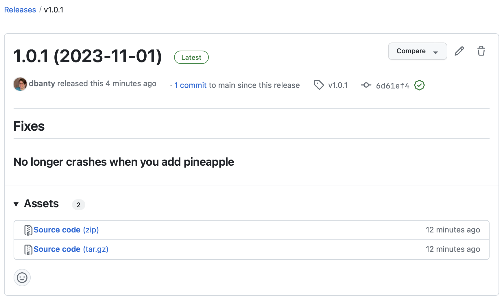

import { TabItem } from "@astrojs/starlight/components";
import SyncTabs from "../../../components/SyncTabs.astro";

This tutorial will take you step by step through the process of:

1. Documenting changes to a package
2. Adding those changes to a changelog
3. Updating version numbers
4. Creating releases on GitHub

:::note

This tutorial creates a new Git repository with a single package.
The [monorepo tutorial](./monorepo) covers automating releases for multiple packages in a single Git repository.

:::

## Prerequisites

- [Git](https://git-scm.com/): The `git` CLI must be available in your terminal.
  It is helpful if you know the basics of commits and tags.
- A text editor: We'll be editing Markdown, JSON, and TOML files. [Visual Studio Code](https://code.visualstudio.com/) is a good free choice.
- Familiarity with a command line terminal, like "Terminal" on macOS or "PowerShell" Windows
- [Install Knope](/installation)

## Creating a project

Create a new empty directory wherever you like and open it in your terminal.

```sh
mkdir knope-tutorial  # create a new directory
cd knope-tutorial     # change into the new directory
```

Initialize a Git repository:

```sh
git init
```

Now open the directory in your text editor and create two files:

```md title="CHANGELOG.md"
# Changelog

This is where the changes in each release are documented.
```

```json title="package.json"
{
  "name": "pizza-builder",
  "version": "1.0.0"
}
```

We're simulating a JavaScript package—in a real package you'd have a lot more info in your `package.json` file,
but `version` is all that Knope needs.
Our package is starting at version `1.0.0`,
as we make changes, the version will increase depending on the type of change.

Before we start making changes, we need somewhere to keep our releases.
Let's create a GitHub repository.
We're going to use the [GitHub CLI](https://cli.github.com/),
but if you have another method you prefer, feel free to use that instead.

```sh
gh repo create --private knope-tutorial --source . --push
```

:::tip
Knope integrates with GitHub for nicer releases.
You can use Knope with other Git hosts, but the results will be a bit different.
:::

## Little changes

Let's start by documenting a small change using a [conventional commit].

```sh
git commit --allow-empty -m "fix: No longer crashes when you add pineapple"
```

We've just documented a bug fix using a commit message!

:::note
In the real world, this commit would also include the relevant code changes.
:::

Let's see what Knope will do to our project when we next release it:

```sh
knope release --dry-run
```

<details>
    <summary>Example output from Knope</summary>
```
Would add the following to package.json: 1.0.1
Would add the following to CHANGELOG.md:
## 1.0.1 (2023-11-01)

### Fixes

#### No longer crashes when you add pineapple

Would add files to git:
package.json
CHANGELOG.md
Would run git commit -m "chore: prepare release 1.0.1" && git push
Would create a release on GitHub with name 1.0.1 (2023-11-01) and tag v1.0.1 and body:
## Fixes

### No longer crashes when you add pineapple

Now that we have somewhere to push our changes, let's try running the release for real:
```
</details>

:::tip
That `--dry-run` flag can be used anywhere in Knope to see what _would_ happen without actually doing it.
:::

According to that output, if we ran this without the `--dry-run` flag, Knope would:

1. Set the version of our package in `package.json` to `1.0.1`
2. Add a new section to `CHANGELOG.md` with the changes we've made
3. Commit those changes to Git and push to our remote repo
4. Create a new release on GitHub

Let's try it for real!

## Creating a release

If we run the `release` workflow again without the `--dry-run` option, Knope will do everything it promised to.

```sh
knope release
```

Our `package.json` has the new version number:

```json title="package.json" {3}
{
  "name": "pizza-builder",
  "version": "1.0.1"
}
```

Our `CHANGELOG.md` contains the message from our commit:

```md title="CHANGELOG.md" {4-8}
# Changelog

This is where the changes in each release are documented.
## 1.0.1 (2023-11-01)

### Fixes

#### No longer crashes when you add pineapple
```

And that same content is in a new GitHub release:

```sh
gh release view --web
```



## More complex changes

[Conventional commits] are great for simple changes, you just start your commit with `fix: ` or `feat: `.
For changes that take more than a few words to describe, though, we'll turn to [changesets].

Let's add a new feature to our package:

```sh
knope document-change
```

You'll get a choice of the _type_ of change.
The terms are from [semantic versioning], so `minor` is what we want for a new feature:

```
? What type of change is this?
  major
> minor
  patch
[↑↓ to move, enter to select, type to filter]
```

After selecting `minor` with the enter key, we can summarize our new feature:

```
> What type of change is this? minor
? What is a short summary of this change? Add calzones
[This will be used as a header in the changelog]
```

This created a new Markdown file for us which we can fill in with more details:

```md title=".changeset/add_calzones.md" ins={6-9}
---
default: minor
---

# Add calzones

In addition to building Pizzas, you can now build calzones! Just use the new `--calzone` option!

> Pizza? Never heard of it. That's what people will be saying in 20 years, because pizza is old news. Pizza is your grandfather's calzone.
```

We can also add a conventional commit into the same release:

```sh
git commit --allow-empty -m 'feat: Added the `olives` topping'
```

Let's do a dry run to see what Knope will do:

```sh
knope release --dry-run
```

<details>
    <summary>Example output from Knope</summary>
```text {16-18,36-38}
    Would delete: .changeset/add_calzones.md
    Would add the following to package.json: 1.2.0
    Would add the following to CHANGELOG.md:
    ## 1.2.0 (2023-11-01)

    ### Features

    #### Added the `olives` topping

    #### Add calzones

    In addition to building Pizzas, you can now build calzones! Just use the new `--calzone` option!

    > Pizza? Never heard of it. That's what people will be saying in 20 years, because pizza is old news. Pizza is your grandfather's calzone.

    ### Fixes

    #### No longer crashes when you add pineapple

    Would add files to git:
    package.json
    CHANGELOG.md
    .changeset/add_calzones.md
    Would run git commit -m "chore: prepare release 1.2.0" && git push
    Would create a release on GitHub with name 1.2.0 (2023-11-01) and tag v1.2.0 and body:
    ## Features

    ### Added the `olives` topping

    ### Add calzones

    In addition to building Pizzas, you can now build calzones! Just use the new `--calzone` option!

    > Pizza? Never heard of it. That's what people will be saying in 20 years, because pizza is old news. Pizza is your grandfather's calzone.

    ## Fixes

    ### No longer crashes when you add pineapple
```
</details>

Uh oh, our fix from the _last_ version is being included again!
That's because Knope uses Git tags to figure out which conventional commits to include in a release.
The release was created on GitHub, but we don't have that tag locally! Let's fix that, then try again:

```sh
git pull --tags
knope release --dry-run
```

<details>
    <summary>Example output from Knope</summary>
```text
    Would delete: .changeset/add_calzones.md
    Would add the following to package.json: 1.2.0
    Would add the following to CHANGELOG.md:
    ## 1.2.0 (2023-11-01)

    ### Features

    #### Added the `olives` topping

    #### Add calzones

    In addition to building Pizzas, you can now build calzones! Just use the new `--calzone` option!

    > Pizza? Never heard of it. That's what people will be saying in 20 years, because pizza is old news. Pizza is your grandfather's calzone.

    ### Fixes

    #### No longer crashes when you add pineapple

    Would add files to git:
    package.json
    CHANGELOG.md
    .changeset/add_calzones.md
    Would run git commit -m "chore: prepare release 1.2.0" && git push
    Would create a release on GitHub with name 1.2.0 (2023-11-01) and tag v1.2.0 and body:
    ## Features

    ### Added the `olives` topping

    ### Add calzones

    In addition to building Pizzas, you can now build calzones! Just use the new `--calzone` option!

    > Pizza? Never heard of it. That's what people will be saying in 20 years, because pizza is old news. Pizza is your grandfather's calzone.

    ## Fixes

    ### No longer crashes when you add pineapple

    ```
</details>

[conventional commit]: ../reference/conventional-commits
[conventional commits]: ../reference/conventional-commits
[changesets]: ../reference/changesets
[semantic versioning]: ../reference/semantic-versioning
